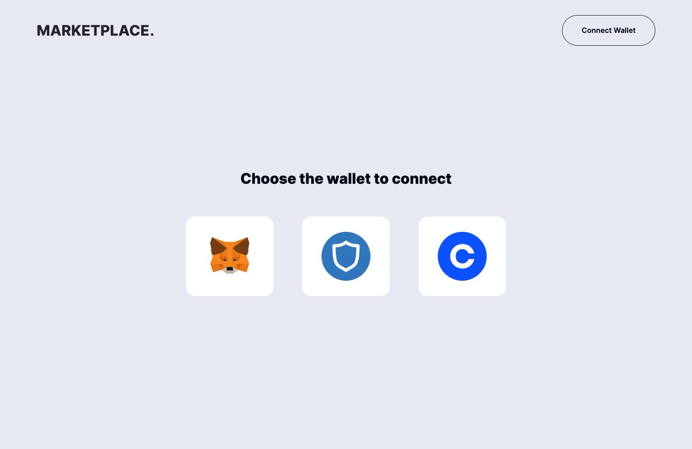
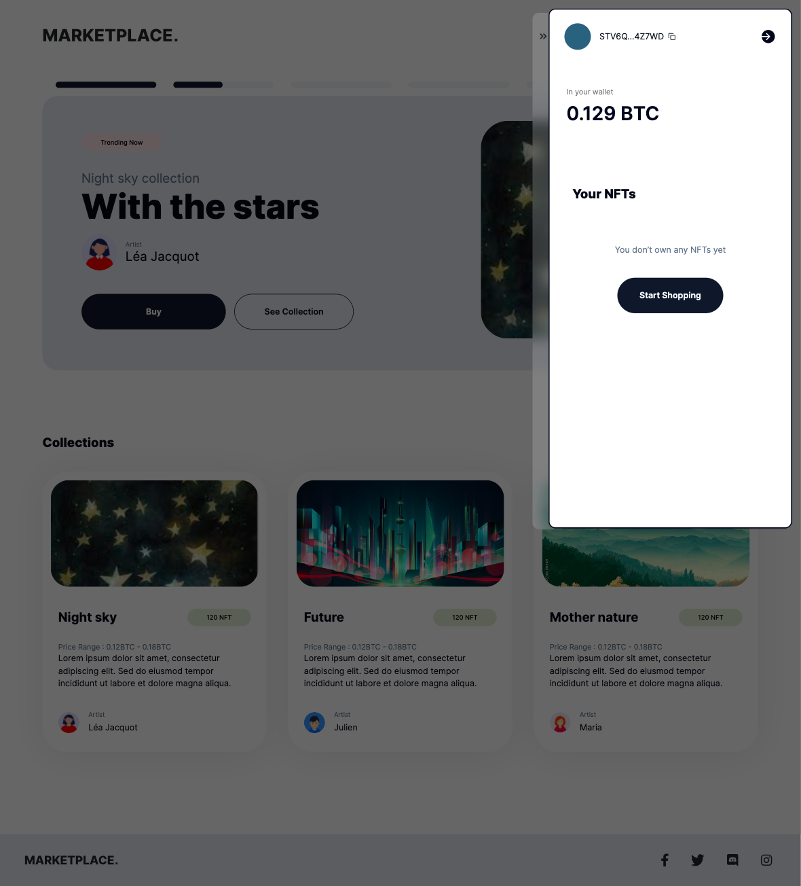

# Risidio Frontend Developer Assessment - My Submission 🚀

## Overview

This project is a frontend implementation of a site similar to an NFT marketplace as part of the Risidio technical assessment. It follows the provided Figma file very closely, using Next.js 14 with server actions, Tailwind CSS for styling, and shadcn/ui to build UI components. It includes advanced features like cookie-based session authentication and connects an SQLite database with Drizzle ORM, hosted on TursoDb.

## Technologies Used 🛠️

- **Next.js 14**: Server actions, SSR capabilities and efficient routing.
- **Tailwind CSS**: For styling.
- **Radix UI && Shadcn/ui**: A headless component library and collection of re-usable components.
- **Jotai**: State management
- **SQLite & Drizzle ORM**: SQLite for database and Drizzle ORM for database interactions.
- **TursoDb**: Hosting the SQLite database in the cloud.
- **Vercel**: Deployment platform.

## Installation 📦

1. **Clone the repository**:

```bash
git clone <repository-url>
```

2. **Install dependencies**:

```bash
npm install
```

3. **Configure your env file**:

```env
TURSO_DB_URL=
TURSO_AUTH_TOKEN=
```

4. **Run the development server**:

```bash
npm run db:init:dev && npm dev
```

5. **Build and start the production server**:

```bash
npm run build:init && npm start
```

## Features 🌟

### Responsive Design 📐

- Adjusts smoothly across different devices ensuring a seamless user experience no matter the screen size. From tablets to laptops to phones—every view is covered!

### Pixel Perfect Implementation 🎨

- In the initial stages of the project, I made adjustments to padding and measurements based on my personal preferences, thinking to enhance the design. However, I realized that adhering to the original specifications Figma file was crucial, as my role was not to alter but to implement.
- Meticulously implemented the Figma design provided by the design team, ensuring high fidelity in the visual implementation.

### Dynamic Routes 🔀

- Each collection page is dynamically generated based on its slug. If a slug is not recognized, the application renders an error state

### Rerouting based on search params 🔙

- Enhances user experience by returning users to their previous action page post-login.
- If you try to buy an nft from collections page while not logged in, after logging in, it takees you back to that same page.

### Toast Notifications 🍞

- Implements toast notifications for user actions. Pretty cool toast animations from Sonner library.

### SQLite Database Integration 💾

- Utilizes an SQLite database to simulate a full-stack application environment.

### Server Actions 🖥️

- Employs server actions for direct, secure interactions with the backend without exposing sensitive logic,
- Similar to API calls but integrated directly within the frontend context for convenience.

### ORM with Drizzle 🌀

- Uses Drizzle ORM to create type-safe objects for database interactions.
- It also improves Developer experience. ORM 🤝 VSCode Intellisense = 💯x Dev

### Wallet and Cart Interaction 💳

- Simulates e-commerce operations where purchasing an NFT subtracts from the virtual wallet balance directly.

### Cookie-based Authentication 🍪

### Jest Testing 🧪

### Subtle Animations and Interactions 🎭

## Assumptions/Personal Preferences 🤔

### Hosting Platform

- Although the project instructions specified hosting on Netlify, I used Vercel due to integration challenges with TursoDb on Netlify. In order to meet the deadline, I opted for vercel while I keep troubleshootingthe issue..

### Image Formats

- I used SVG exports from the Figma design for most images. However, some images could not be exported in SVG format, leading to inconsistent image formats/styling.

### Design

- Added a black blur screen when the sidebar is active,, preventing interaction with other elements until the sidebar is closed.
- Corrected a typo from "NTF" to "NFT," assuming it was an oversight in the original design.
- Implemented toast notifications despite them not being part of the original design.
- Made entire cards clickable on the home page instead of just the button.
- Introduced mock wallet images on the connect page deespite being blank on the design.
- Applied my own judgment for responsive design

### API/Backend

- Decided to use SQLite for mock data
- Using Nextjs Server componenets & action
- Created dynamic collection pages
- Created a schema based on my interpretations

Overall, I had a blast working on this project! This task was more than just a test for me; it was a journey packed with growth and excitement. I really hope to bring this energy and passion to Risidio. Fingers crossed and looking forward to possibly joining! Last but not the least heres a some images for comparison:

<div style="display: flex; padding: 2px; justify-content: space-around;">
   
    
</div>

<div style="display: flex; padding: 2px; justify-content: space-around;">
   
    
</div>

<div style="display: flex; padding: 2px; justify-content: space-around;">
   
    
</div>

<div style="display: flex; padding: 2px; justify-content: space-around;">
   
    
</div>
